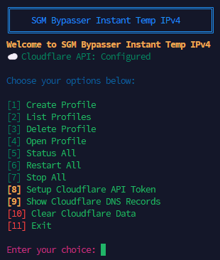

# 🚀 instant-ipv4-tunnel-v2


A complete IPv4 tunnel management system with Cloudflare DNS automation, profile management, Discord notifications, and automatic tunnel recovery.


Unlike the original version, this release uses your own Cloudflare account API token to automatically manage DNS records and provide stable domain access.


---


## ⚡ What's New in V2?


✨ Cloudflare DNS Automation


✨ Custom Domain Support


✨ Multi-Profile Management


✨ Discord Bot Notifications


✨ Discord Webhook Notifications


✨ Automatic Tunnel Recovery


✨ Auto DNS Update When Tunnel Changes


✨ Cloudflare DNS Record Management


✨ Built-in Status Dashboard


✨ Persistent Configuration Storage


---


## 🔥 Features


⚡ Instant IPv4 tunneling


🌐 Automatic Cloudflare DNS creation & updates


📡 Dynamic Pinggy tunnel monitoring


🔄 Auto-reconnect when tunnels disconnect


🧠 Multi-profile management system


☁️ Cloudflare API integration


🤖 Discord Bot notifications


📢 Discord Webhook notifications


🛠️ Beginner-friendly interactive menu


💾 Persistent configuration database


📊 Tunnel status monitoring


---


## 🚀 Why use it?


💡 Perfect for users who:


* Need stable access behind CGNAT

* Want a custom domain instead of random tunnel links

* Run VPS services remotely

* Access SSH from anywhere

* Need automatic DNS management

* Want tunnel notifications through Discord

* Manage multiple servers or services


---


## 🧪 How it works


1️⃣ Configure your Cloudflare API Token


2️⃣ Create a profile


3️⃣ Configure a port and DNS record


4️⃣ Start the tunnel


5️⃣ The script automatically:


* Creates DNS records

* Monitors the tunnel

* Updates DNS if the tunnel IP changes

* Restarts disconnected tunnels

* Sends Discord notifications


---


## ☁️ Cloudflare API Token Setup


Go to Cloudflare website and login.


Search for:


Account API Tokens


Click it and then click:


Create Token


You will see:


Edit policy


Click on it.


By default it may show:


Entire Account


Change it to:


Specific Domains


Then select the domain you want to use.


Scroll down to the permissions section.


Click on DNS & Zones select: 


DNS


Read


Edit ✅


Under DNS select: 


Zone


Read


Edit ✅


Required permissions:


DNS

Grants write access to DNS


Read


Edit ✅


Zone

Grants write access to zone management


Read


Edit ✅


After that scroll down without changing anything else.


Click:


Review Token


Then:


Create Token


Copy your API token and save it somewhere secure.


You can now use that token inside the script.


---


## 🌌 Gallery





---


## ⚙️ Installation & Usage


```bash

bash <(curl -fsSL https://raw.githubusercontent.com/ShahedPlayz/instant-ipv4-tunnel/main/instant-ipv4.sh | tr -d '\r')

```


---


## ⚠️ Security Notice


This script uses your Cloudflare API Token to manage DNS records.


Never share your API token with anyone.


Only use API in SGM Bypasser Script because its secure, Your API Token Stays Safe.


Store your token securely.


---


## 📜 License


Use responsibly.


Cloudflare®, Discord®, and Pinggy® are trademarks of their respective owners.
